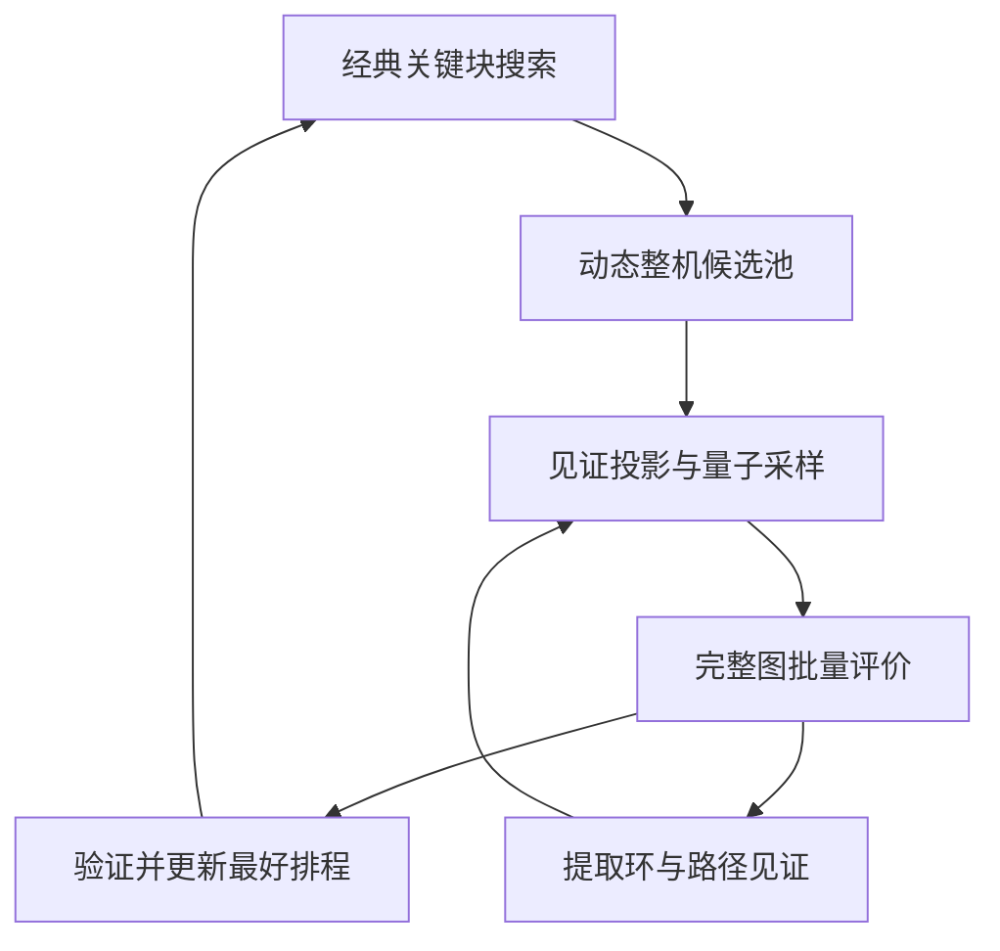

**量子—经典协同 JSP：统一建模、实现现状与改进方向**

整理日期：2026-10-03。代码核对版本：[jsp-quantum-evolution @ 3217e825](https://github.com/Hejie-Wang/jsp-quantum-evolution/tree/3217e8255166191ff58a850f1def5ebf3e2b72c8)。实验数字取自仓库已有报告；本次为代码与文档整合，没有重新跑 GPU 或 QPU 实验。下文将“现有实现”“条件性数学保证”“待验证方案”分别说明。

当前路线是：**经典侧产生整机候选顺序并验证完整排程，量子侧利用跨机器见证塑造采样分布，寻找有价值的多机候选组合。** 已落地的是动态候选搜索、约束相位与混合器、合法子空间精确模拟和 CPU/CUDA 图评价。现有实验尚未显示稳定的量子增益。

**1．问题与编码**

考虑标准 JSP：J 个作业、M 台机器、JM 道工序，每道工序 v 的处理时间为正数 p_v，作业内工序路线固定；本仓库的大实例为 50×20，即 1,000 道工序。目标为最小化最大完工时间 C_max。

每台机器 m 保存若干条完整加工顺序：

$$
\Pi_m=\{\pi_{m,0},\ldots,\pi_{m,K_m-1}\},\qquad a_m\in\{0,\ldots,K_m-1\}.
$$

一组标签 a=(a_1,…,a_M) 决定各机器的完整顺序。每个候选必须恰好包含该机器需要加工的全部工序。候选可以通过交换、插入或已有排程生成，但**量子变量表示整机候选，不表示单个交换动作**。

现有门级实现使用 one-hot 编码：

$$
\sum_{a=0}^{K_m-1}x_{m,a}=1,\qquad
\mathcal H_{\rm legal}=\bigotimes_{m=1}^{M}\operatorname{span}\{|a_m\rangle\}.
$$

数据量子比特数为 Σ_m K_m，合法组合数为 ∏_m K_m。20 台机器、每机 8 个候选需要 160 个数据位，但对应 8^20=2^60 个组合。二进制编码可减少数据位，但还需处理非法标签、选择谓词和混合器综合；目前主线没有改成二进制编码。

这里的“合法子空间”只保证每台机器选择一个候选，**不自动保证排程无环**。

**2．完整图评价与跨机器关联**

由 a 构造有向图 G(a)：固定作业前驱边，加上各机器所选顺序的相邻工序边。若存在有向环，组合不可行；否则按拓扑顺序计算：

$$
s_v=\max_{u\to v}(s_u+p_u),\qquad
C(a)=\max_v(s_v+p_v),
$$

无前驱工序的开始时间为 0。这一评价包含所有机器；动态窗口以外的机器仅固定顺序，其工序和约束仍参与图计算。

经典侧从图中提取两类见证 W：有向环 C，以及长度 L_P 超过目标工期 T 的有向路径 P。见证保存原始工序与必要机器先后关系 R_m(W)，再投影到当前候选池：

$$
A_m(W)=\{a:\operatorname{pos}_{\pi_{m,a}}(u)<\operatorname{pos}_{\pi_{m,a}}(v)
\ \text{对所有 }(u,v)\in R_m(W)\},
$$

$$
P_W=\bigotimes_m\left(\sum_{a\in A_m(W)}|a\rangle\langle a|\right).
$$

未涉及的机器允许全部标签。若某台机器的集合为空，该见证在当前池上不可能触发。**同一机器涉及多条关系时必须取交集**；这已由 `derive_witness` / `witness_support` 实现和校验。

P_W 表示“这些机器的选择共同保留了该环或路径”。例如一个三机见证对应条件 `(a₁∈A₁) AND (a₂∈A₂) AND (a₃∈A₃)`，不能直接替换成三台机器各自的坏分数，也不能默认拆成两两作用。这是当前建模中保留跨机器关联的核心。

投影只要求先后关系成立，不要求原边在新候选中仍相邻：中间插入其他工序后，先后关系仍由路径实现，原路径长度仍是有效下界。换池后必须从原始见证重新生成标签集合；旧标签掩码不能直接复用。

**3．哈密顿量及“基态对应最优”的准确含义**

当前动态搜索固定目标 T=C_best−1，对已收集见证使用：

$$
H_T=\sum_{C\in\mathcal W_C}w_C P_C+
\sum_{P\in\mathcal W_P:L_P>T}w_P P_P,\qquad w_C,w_P>0.
$$

当前 `CompactSimulator` 默认所有权重均为 1，训练目标是已知见证能量的期望值。它不是完整 C_max 成本表，也没有实现可逆调度评价电路。

必须区分三个层次：

| 层次 | 可以成立的结论 | 必要条件或限制 |
|---|---|---|
| 固定 T 的可行性模型 | 零能量等价于存在满足 C≤T 的该候选组合 | 见证必须排除所有有环组合，并覆盖所有超 T 组合 |
| 带 T 寄存器的优化模型 | 基态能量等于当前候选池内最优工期 | 完整的有效约束覆盖、足够大的惩罚和足够的 T 表示范围 |
| 原始 JSP 的全局最优 | 池内最优等于原问题最优 | 候选池含至少一个全局最优组合，或结果达到独立的全局下界 |

说明第二行的一个充分条件：设池内存在工期不超过 U 的可行排程，整数 T 的范围为 0,…,U，定义

$$
H_{\rm opt}=\hat T+\Lambda\left[
\sum_C P_C\otimes I_T+
\sum_P P_P\otimes\mathbf 1(\hat T<L_P)\right],\qquad\Lambda>U.
$$

如果每个有环组合至少触发一条环见证，每个可行组合的最长路径都被覆盖，则违反约束的状态能量大于 U；合法状态的最低 T 恰为其工期，因此 E₀=C_pool*。这里权重取 1；若改变权重，惩罚下界也必须相应重算。

当前运行的是**有限见证、固定 T、动态换池的启发式版本**。所以：

- 有限见证下的零能量可能遗漏真实环或超工期路径，必须进行完整图验证。
- 固定 T 的零能量状态之间没有工期排序；更好的真实工期由外层验证后更新 T。
- 在上述 T 寄存器模型中，删去有效非负约束得到的精确基态能量是池内最优的下界；一次量子测量得到的能量不是该下界的证明。
- 基态与最优解对应，不意味着演化能快速到达基态；当前没有谱隙、收敛速度或量子优势的证明。采样失败也不能证明目标不可行。
- 当前保证不增的是独立验证后的历史最好工期。禁忌搜索的当前状态可以变差；动态换池、换见证后，能量值也不宜跨轮直接比较。

**4．量子搜索如何执行**

电路顺序为：合法初态 → `[见证相位 → 单机 XY → 多机联合跃迁] × p` → 测量。

见证相位为 exp(−iγH_T)。相位本身不改变候选的测量概率；后续混合器通过干涉改变采样分布。

单机 XY 门在合法子空间内实现候选间旋转，其生成元为

$$
|a\rangle\langle b|+|b\rangle\langle a|
\equiv\frac{X_{m,a}X_{m,b}+Y_{m,a}Y_{m,b}}2.
$$

实现按顺序施加各候选对的门；这些门一般不对易，应将其理解为有序门乘积，不能直接视为“所有 XY 项之和”的精确一次指数演化。

联合跃迁一次改变支撑集合 S 中 2–4 台机器的候选：

$$
J_{a,b,S}=(|a_S\rangle\langle b_S|+|b_S\rangle\langle a_S|)\otimes I_{\bar S},
\qquad U_J=e^{-i\eta gJ_{a,b,S}}.
$$

现有实现使用 CX/X 与多控 Rx 构造精确两态旋转，无须综合完整稠密酉矩阵。它保持 one-hot 合法性，但不保证落点无环或更优。当前动作由见证掩码启发式生成，尚没有“指向全局最优”的保证。

与最初的绝热演化设想相比，当前已落地的是**交替算子变分采样与经典外循环**。小规模精确模拟用于核对相位、混合器和采样效果；真实 QPU 接入尚未完成。

**5．协同流程与代码入口**



实际外循环还会把量子提议与本轮经典邻域候选比较；图中突出的是两侧的信息交换。

| 模块 | 当前职责 |
|---|---|
| `code/candidate_quantum_medium/medium_qjsp.py` | 实例读取、初始候选与排程生成、完整图解码、排程校验、见证分离和支持集计算 |
| `code/candidate_quantum_gates/circuits.py` | 候选/见证/联合动作定义，合法初态、约束相位、XY 与联合门 |
| `search_loop.py`（同一 gates 目录，下同） | 固定池实验闭环、见证转换、联合动作生成和门级参考后端 |
| `compact_simulator.py` | 合法候选子空间的精确经典模拟、参数训练和采样 |
| `adaptive_search.py` | 动态候选池、关键块邻域、禁忌与重启、周期性组合提议 |
| `batch_evaluator.py` / `evaluate_batch.cu` / `transpose_bm_mj.cu` | Numba/CUDA 批量图评价、环检测与工期计算、GPU 数据布局转换 |
| `pool_optimum_milp.py` | 独立求解固定候选池内最优，用来诊断候选覆盖限制 |
| `benchmark_adaptive.py` / `benchmark_components.py` | 配对搜索对照与组件计时；`benchmark_bounds.json` 记录实例身份与公开界 |

动态主线的默认参数与行为：

1. 用 240 次调度生成获得共同初态。经典侧从关键机器块产生边界相邻动作，每 10 轮扩展非相邻插入；禁忌期限为 7–18 轮，连续 600 轮未改善时重启。
2. `uniform` / `quantum` 模式每 40 轮更新一次组合窗口：最多 6 台活跃机器，每机最多 3 个候选；当前顺序为候选 0，其余机器固定。当前备选来自已评价为可行的单机动作，活跃机器使用随机选择。
3. 保留最多 96 条近期原始见证，每次换池重新投影。量子模式默认 2 层、12 次参数评价、64 shots；当前每次调用重新训练，虽然模拟器已有 `warm_params` 接口，动态调用还没有跨轮使用它。
4. 采样后去重，完整评价组合，并从最多 8 个采样组合补充见证。提议优于当前排程且优于本轮已选经典邻居时才接纳；改善历史最好工期时再次独立验证。
5. `classical` 为默认模式；`uniform` 是无量子演化的组合采样对照；`quantum` 使用精确经典模拟，`hardware_jobs_submitted=0`。

压缩模拟器的状态数为 ∏K_m，硬上限 65,536；当前默认动态窗口至多 3^6=729 个状态。它枚举这些状态上的**已知见证能量**，没有枚举完整排程成本，但依然是指数状态空间的经典模拟，不能据此证明量子速度优势。

最新 CUDA 路径已实现：整批原始布局上传、设备端分块转置、一次上传供多个评价内核分块使用、工作缓冲复用、同步后返回结果。每个候选图由一个 CUDA 线程评价。`--backend cuda` 仅加速经典图评价，量子模拟部分仍是 NumPy 实现。

CPU 与 CUDA 应依实际批量大小选择；当前量子调用仅 64 shots，去重后批次可能更小，不能把大批量吞吐直接外推到这些调用的端到端收益。

**6．资源与已记录效果**

| 场景 | 资源或结果 | 解读 |
|---|---|---|
| 20 台机器、每机 8 候选的资源编译 | 160 数据位 + 23 共享工作位 = 183 逻辑位 | 来自 15×20 派生池的编译实验，并非 183 位状态向量模拟 |
| 上述 44 条见证的相位电路 | 2,056 个 CX、深度 2,732 | 特定通用门基编译结果；不是完整多层电路或物理硬件资源 |
| 默认 50×20 动态窗口 | 最多 729 个合法组合、32 个候选数据位 | 包含固定机器的单候选位；量子搜索窗口远小于全机器候选空间 |
| 2026-10-02 组件实验 | Numba 图评价约 71.7 倍；压缩模拟训练约 76.5 倍 | 都是经典实现相对原实现的组件加速，不是量子加速 |

“几百量子比特”在逻辑编码层面可以满足，但还需单列纠错开销、硬件连通性、双比特门数量、深度及噪声；只比较位数不足以判断硬件可行性。

已有动态实验采用 6 个实例、2 个种子、3 种模式，共 36 组；每组 10 秒搜索，初始化/JIT 单列并记录端到端时间。12 个实例—种子组的平均相对差距分别为：经典 **5.73%**，均匀组合提议 **6.36%**，量子模拟提议 **6.43%**。这不是足够的统计样本，但目前不能说量子侧稳定改善了表现。

以下为三个 50×20 实例各模式在两个种子中的最好值。基准值来自仓库 2026-10-02 已校核记录，三例均记为 LB=UB；差距为 100×(C/UB−1)。

| 实例 | 已知最优/UB | 动态经典 | 均匀组合 | 量子模拟组合 | 量子模式距 UB |
|---|---:|---:|---:|---:|---:|
| ta61 | 2868 | 2973 | 3010 | 3018 | 5.23% |
| ta62 | 2869 | 3117 | 3102 | 3118 | 8.68% |
| ta63 | 2755 | 2852 | 2931 | 2945 | 6.90% |

量子提议曾有 17 次直接改善历史最好工期，但其耗时也减少了经典搜索预算，所以“提议偶尔有效”与“整体算法变好”是两个问题。仓库较早 C++ 搜索在 ta62 有 60 秒得到 3051 的记录，预算不同，不应把本轮方法写成已超过所有经典实现。

上述数据和 37 项通过、1 项 GPU 测试跳过的记录来自此前版本；不能当成最新 CUDA 改动已复测的证据。本次没有新的 GPU 或 QPU 性能测量。另外，最新 `bench_cuda_baseline.py` 的 `best_of` 读取的是累计 `ev.seconds`，且该计时不含入口校验；要报告可靠 GPU 加速比，应改为独立墙钟区间并使用真实邻域批次，不能直接引用其当前输出。

**7．下一步：先让量子采样的目标更接近真实改善**

以下是建议方案，尚未作为新功能实现或验证。优先保留现有经典评价器，把主要工作放在量子模型、联合动作和训练目标上。

**第一步：路径严重度加权，并覆盖多条关键路径。** 当前“一条轻微超期路径”和“一条严重超期路径”罚分相同；单纯减少见证数可能不缩短瓶颈路径。可对已知超 T 路径设

$$
d_P=L_P-T>0,\qquad
w_P=\varepsilon+(1-\varepsilon)\min(1,d_P/\sigma),\quad 0<\varepsilon<1.
$$

σ 在一次训练期间固定，防止目标随参数评价漂移。补充少量不同支路的关键或近关键路径，按原始关系去重；只有 L_P>T 的路径参与当前违约相位。环保持独立正权重。

同一见证集上，正权重保留零能量集合，但会改变非零能量排序；它不会补全缺失约束，也不保证与真实工期严格单调对应。先在未用于训练的组合上测量“低代理能量却高工期/有环”的比例，再决定是否扩大线路。

```python
# 拟新增的权重规则；不是当前仓库已接入的接口。
def witness_weight(kind, length, target, scale, epsilon=0.1):
    if scale <= 0 or not 0 < epsilon < 1:
        raise ValueError("invalid scale or epsilon")
    if kind == "cycle":
        return 1.0
    if kind != "path":
        raise ValueError("unknown witness kind")
    if length <= target:
        return 0.0
    return epsilon + (1.0 - epsilon) * min(1.0, (length - target) / scale)
```

权重必须同步进入门级相位和压缩模拟器，不能只改其中一端。

**第二步：按多条见证的共同结构选窗口和联合跃迁。** 把机器作为顶点、见证支撑集合作为超边，按超期程度和重复阻塞情况衡量联系强度。优先选择被多条见证共同约束的机器，而不是随机抽活跃机器；联合动作应尝试同时修复多条约束，避免刚破坏一条路径就触发另一条。

动作生成先限制在 2–4 台机器，不求解完整组合空间；保留单机 XY 通道以维持搜索连通性。另设小比例探索候选，允许部分“单独应用时不可行、联合应用可能可行”的整机顺序进入池；最终仍用完整图拒绝有环组合。当前先过滤单机不可行候选的策略可能提前排除了这种协同机会。

这一改变本身也能帮助经典搜索，必须让经典联合搜索获得同一候选池、同一见证和同一联合动作。只有量子分布在相同信息下表现更好，才能把差异归因于量子机制。

**第三步：热启动和训练目标调整。** 对当前候选 a_m⁰，可使用偏向当前解但保留探索的初态：

$$
|\psi_0\rangle=\bigotimes_{m:K_m>1}\left[
\sqrt{1-\delta}\,|a_m^0\rangle+
\sqrt{\frac{\delta}{K_m-1}}\sum_{a\ne a_m^0}|a\rangle\right],\quad0<\delta<1.
$$

单候选机器保持其唯一状态。跨轮复用适当归一化后的角度，减少每次从头训练的开销；候选重编号后要按真实工序顺序匹配，不能把旧标签当成同一个候选。热启动文献提供了设计依据，但上述“当前解偏置”不是原论文的完整松弛与混合器构造，不能继承其理论保证。[R2]

训练目标分两级试验：先用已知见证能量的低尾 CVaR，减少大量差样本对均值的主导；再用测量所得组合的真实工期 CVaR 或 P(C≤T) 校准，图评价仍由经典侧执行，只评价实际采样组合，不构造完整成本表。CVaR 在变分优化中有先例，但是否改善本项目需要实验。[R3]

实现时注意：当前 `sample()` 返回去重标签，会丢失频数。CVaR/成功率训练必须保留原始测量计数；可以只评价唯一组合，再按计数聚合成本。用去重后的列表直接算 CVaR 会改变所优化的分布。所有额外图评价和参数训练时间必须计入预算。

**第四步：用收益控制调用频率，再扩大窗口。** 比较“每 40 轮固定调用”与“停滞时调用、按近期每秒改善量调预算”；结合热启动降低开销。小窗口验证成功后，再尝试 8 台机器×4 候选，恰为 65,536 个合法状态，可用当前模拟器作受控实验。继续增大需要新的模拟或硬件方案；超过软件上限不等于超出经典算法能力。

**8．如何证明改进有效，以及量子优势应如何表述**

量子侧的研究假设应具体表述为：**在保留跨机器高阶关联的候选空间里，相位干涉与联合混合能否以更少总资源，提高采到可行改进组合的概率？** 纠缠使联合状态不必分解成逐机独立分布，但不会自动读出未编码的约束或全局最优方向。

最终由经典侧取采样集合中的最小工期，并不会自动抹去量子贡献；关键是候选集合是否因量子采样而更好，以及产生这个集合是否值得其成本。若同信息的经典采样或联合搜索更便宜、更稳定，现阶段就应把收益归于经典方法。

建议逐项消融，而非一次叠加所有改动：

| 对照 | 要回答的问题 |
|---|---|
| 经典 / 均匀组合 / 仅 XY / XY+联合 | 量子演化与联合门分别贡献多少？ |
| 原能量 / 路径加权 / 多路径覆盖 | 能量与真实改善是否更一致？ |
| 随机窗口 / 见证关联窗口 | 收益来自候选改进，还是量子分布？ |
| 冷启动 / 热启动 / 跨轮参数复用 | 是否减少训练成本、提高有限预算表现？ |
| 均值 / CVaR / 实际目标成功率 | 分布低尾质量是否提高？ |

分两种口径报告：其一，冻结相同候选池和见证，给相同完整图评价预算，比较改善概率、可行率和目标工期成功率；其二，计入候选生成、训练、编译、传输、采样和验证的总时间，比较工期差距及到达目标所需时间。至少扩展到 10 个配对种子，并给出不确定性区间。

当前 729 状态小窗口还应加入完整枚举与池内 MILP 参照，确认有没有可改进解、量子到底漏掉了什么；这些诊断结果不得反向泄漏最优标签给提议生成器。扩大规模时继续保留强经典基线，而不能仅与均匀随机搜索比较。

现有有限 JSP 实例当然能被经典穷举求解，部分基准的最优值已经已知。因此不能以“经典算法无法解决”为当前证明目标；应先证明相同资源下的稳定实际收益，再研究随规模增长的优势。当前模型没有给出这种复杂度分离或快速基态制备证明。

**9．当前复现入口与资料索引**

在仓库根目录、依赖齐备的 `qskit` 环境中运行：

```bash
# 当前动态主线：经典基准与量子模拟提议
conda run -n qskit python code/candidate_quantum_gates/adaptive_search.py task_data/tai50_20_01.txt --mode classical --seconds 10 --seed 7 --output results/ta61_classical.json
conda run -n qskit python code/candidate_quantum_gates/adaptive_search.py task_data/tai50_20_01.txt --mode quantum --seconds 10 --seed 7 --output results/ta61_quantum_sim.json

# 有匹配 CUDA/CuPy 环境时，仅将经典批量图评价切到 GPU
conda run -n qskit python code/candidate_quantum_gates/adaptive_search.py task_data/tai50_20_01.txt --mode quantum --backend cuda --seconds 10 --seed 7 --output results/ta61_quantum_sim_cuda_eval.json

# 配对实验与现有一致性测试
conda run -n qskit python code/candidate_quantum_gates/benchmark_adaptive.py --seconds 10 --output results/adaptive_comparison
conda run -n qskit python -m unittest discover -s code/candidate_quantum_gates -p 'test_*.py' -v
```

`--seconds` 是初始化后的搜索预算，进行中的批次可能越过截止时刻；比较时同时读取 `setup_seconds`、`search_seconds` 和 `wall_seconds`。这些命令属于现有代码入口，本次整合没有重新执行。

仓库资料（均固定到本次核对版本）：

- [门级设计与运行入口](https://github.com/Hejie-Wang/jsp-quantum-evolution/blob/3217e8255166191ff58a850f1def5ebf3e2b72c8/code/candidate_quantum_gates/README.md)
- [门级修正、资源编译与池内最优诊断](https://github.com/Hejie-Wang/jsp-quantum-evolution/blob/3217e8255166191ff58a850f1def5ebf3e2b72c8/docs/candidate_quantum_improvements_results_20261002.md)
- [动态候选、加速和对照结果](https://github.com/Hejie-Wang/jsp-quantum-evolution/blob/3217e8255166191ff58a850f1def5ebf3e2b72c8/docs/candidate_adaptive_results_20261002.md)
- [动态搜索代码](https://github.com/Hejie-Wang/jsp-quantum-evolution/blob/3217e8255166191ff58a850f1def5ebf3e2b72c8/code/candidate_quantum_gates/adaptive_search.py)
- [压缩模拟器代码](https://github.com/Hejie-Wang/jsp-quantum-evolution/blob/3217e8255166191ff58a850f1def5ebf3e2b72c8/code/candidate_quantum_gates/compact_simulator.py)
- [实例身份、公开上下界与来源](https://github.com/Hejie-Wang/jsp-quantum-evolution/blob/3217e8255166191ff58a850f1def5ebf3e2b72c8/code/candidate_quantum_gates/benchmark_bounds.json)

相关原始论文：

- [R1] Hadfield et al., [From the Quantum Approximate Optimization Algorithm to a Quantum Alternating Operator Ansatz](https://arxiv.org/abs/1709.03489)。用于约束子空间与混合器的设计背景；本项目 one-hot 保持不等于 JSP 无环保持。
- [R2] Egger, Mareček, Woerner, [Warm-starting quantum optimization](https://arxiv.org/abs/2009.10095)。用于热启动思路，不构成本项目的收益保证。
- [R3] Barkoutsos et al., [Improving Variational Quantum Optimization using CVaR](https://arxiv.org/abs/1907.04769)。用于低尾分布训练目标；论文实验结论不能直接外推到 50×20 JSP。
