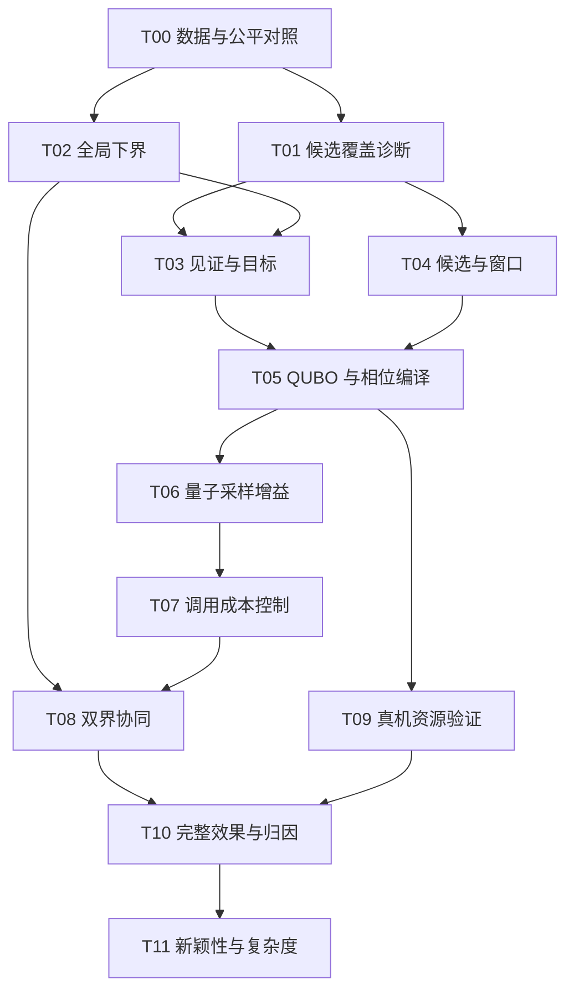

# 量子计算能否改善JSP问题的求解+子问题拆解TODO

日期：2026-10-03。基线：[`bb757f42`](https://github.com/Hejie-Wang/jsp-quantum-evolution/tree/bb757f42ada593ee810fff7d1b3794a1c489b8ec)，已合并 PR #16。

本文将前期讨论拆解为可实现、可证伪、可验收的研究任务，供本地 coding agent 分批实现。本文是**研究设计**，不是新实验结果；所有 TODO 初始均未完成。本次仅新增报告，不修改算法、既有调研报告或实验数据，不提交 QPU 作业。

核心问题是：在明确的资源预算下，量子模块能否降低 JSP 获得好解或认证界的总成本？方案采用**经典侧维护完整调度正确性与认证界，量子侧参与有价值的局部候选组合搜索**。不预设量子必然获益，也不把完整算法改进自动归因于量子。

## 1. 已有证据与必须修正的判断

下列数字来自仓库已有结果，本报告未重新运行性能实验。

| 已有证据 | 当前含义 | 对应任务 |
|---|---|---|
| 六实例、两种子、每组 10 秒搜索：经典／均匀组合／量子模拟平均 gap 为 5.73%／6.36%／6.43% | 尚未显示稳定量子整体收益；样本不足以作普遍结论 | T00、T06、T10 |
| 量子提议调用 3,808 次，17 次直接改善历史最好工期 | 存在有效提议，但未证明超过同成本经典替代 | T06、T07 |
| ta01 旧固定候选池的认证最优为 1462，而原实例已知最优为 1231 | 候选覆盖可能比求解器更先构成瓶颈 | T01、T04 |
| 默认窗口至多 3^6=729 个候选组合 | 适合离线完整枚举诊断，不能据此宣称超越经典能力 | T01 |
| `medium_qjsp.py` 已实现见证割 QUBO；Kaiwu 后端是经典 SA | 研究现有 QUBO 的有效性，不把它当作新引入或量子硬件结果 | T05 |
| `uniform` 也构造 `CompactSimulator` 的全空间数据 | 需要独立廉价均匀对照，避免给经典对照附加不必要开销 | T00 |

出处：[动态结果](candidate_adaptive_results_20261002.md)、[原始汇总](../code/candidate_quantum_gates/results_adaptive_20261002/summary.json)、[池内 MILP 证据](../code/candidate_quantum_gates/results_p3_20261002/pool_milp_evidence.json)、[统一建模文档](quantum_classical_jsp_model_implementation_20261003.md)。

现有调研报告中的以下推断不作为本计划前提：

1. **见证支撑机器数不等于必须同时改变的机器数。** 若坏见证是 `z1 AND ... AND z5`，改变任一因子使其为零即可解除该见证。因此 `max_support=4` 限制动作表达能力，但不能推出五机见证无法解除。联合困难要从多条约束的相互作用及实际可行改进中测量。
2. **条件相位也可产生跨机器量子关联。** 谓词由经典预计算不等于相位算符没有纠缠能力；不能把联合混合器称为唯一跨机器量子算符。
3. **当前理想量子模拟的回退不能归因于硬件热化。** 退火器热化、门型 QPU 噪声、无噪声经典模拟必须分开验证。
4. “未检索到先例”不等于新颖性证明；“基态对应最优”不等于快速制备基态；一次采样未找到解不等于不可行。

## 2. 统一数学定义与作用域

设工序集合为 V，处理时间为正整数 p_v，作业内固定前驱边为 E_J，机器 m 上工序集合为 V_m。完整 JSP 为

$$
C^*=\min_{s\ge0}C_{\max},\quad
s_v\ge s_u+p_u\ ((u,v)\in E_J),\quad
[s_u,s_u+p_u)\cap[s_v,s_v+p_v)=\varnothing\ (u,v\in V_m,u\ne v),\quad
C_{\max}\ge s_v+p_v.
$$

候选池为 Π=(Π_1,…,Π_M)，Π_m 包含 K_m 条完整机器顺序，a_m 选择其中一条。量子变量继续表示**整机候选**，不改成单步交换变量。合并所选机器顺序与 E_J 得图 G(a)：有环时不可行，无环时 C(a) 等于加权最长路径长度。定义 F_Π 为池内无环组合，C_Π^*=min_{a∈F_Π} C(a)。

$$
L_{\rm global}\le C^*\le C_\Pi^*\le U_\Pi,
\qquad L_\Pi\le C_\Pi^*.
$$

其中 U_Π 是经过独立验证的池内排程工期。**L_Π 与 C* 没有一般的上下界关系**；窗口外机器固定后所得界同样只适用于该受限域。池或固定条件变化后，旧池界不得沿用。

见证 W 是环或已知路径。A_m(W) 是保留该见证所需全部机器先后关系的候选标签集合，同一机器涉及多条关系时取交集。定义

$$
z_{mW}(a)=\mathbf1[a_m\in A_m(W)],\qquad
P_W(a)=\prod_{m\in S_W}z_{mW}(a).
$$

环见证 P_W=1 证明该组合不可行；路径见证 P_W=1 证明 C(a)≥L_W（对无环组合）。原始工序关系可跨候选池复用，标签掩码必须重新投影。局部见证若使用窗口外固定关系，提升为全局割时必须保留这些条件，不能无条件删除。

设 L 为独立认证的全局下界、U 为已验证上界。整数目标 T 的不可行性若在**完整域或合法松弛域**得到证明，才可更新 L←max(L,T+1)。普通量子/SA 采样失败、超时和求解器 `UNKNOWN` 均不得提高 L。

## 3. 数据集、实验预算与共同验收规则

### 3.1 固定数据分层

| 编号 | 数据集与来源 | 用途及规模 | 划分规则 |
|---|---|---|---|
| D0 | `candidate_quantum_demo` 的 3×3；生成 2×2、3×3、4×3 标准 JSP | 正确性、池最优、界作用域、QUBO 等价性；各规模 10 个种子 | 种子 0–4 开发、5–9 验证；4×3 全排列组合上限为 (4!)^3=13,824 |
| D1 | 仓库 ta01、ta11、ta21、ta61、ta62、ta63 | 与旧结果衔接；性能验证 | 开发种子 0–4；锁定后确认种子 100–119；7、11 仅复现历史 |
| D2 | 从 D1 的纯经典轨迹独立采集冻结窗口 | 候选覆盖、代理目标和采样对照；初期 K≤3、活跃机器≤6 | 每例每种子保存迭代 0、100、500、1000、5000 的窗口；到达失败也记录 |
| D3 | Taillard `ta30js`、`ta40js` | 探索全局下界；本次检索时尚未闭合 | 已有 `task_data/ta30.txt`；ta40 按标准来源补齐并逐项核对 |
| D4 | 最终扩展：ta01–ta30、ta61–ta70 | 检验跨实例泛化，防止只对六例有效 | D1 为开发实例，其余为锁定配置后的外部验证实例；全量发布结果 |
| DQ | 从 D2 的验证集预选 6 个窗口 | 真机资源和噪声验证 | 至少含低／中／高改进密度，每档 2 个；按经典结构选，不能按量子收益选 |

D0 生成规则：每作业随机排列所有机器，处理时间独立均匀取整数 1–9；记录生成器、随机数库版本、种子和实例哈希。使用完整机器排列枚举得到小实例精确 C*，同时构造受限池检查“池界不等于全局界”。

D1 的具体文件：`tai15_15_01_test.txt`、`tai20_15_01_test.txt`、`ta21.txt`、`tai50_20_01.txt`、`tai50_20_02.txt`、`tai50_20_03.txt`，均位于 `task_data/`。实例身份以全部工序时间和路线一致为准，不只比较文件名。

D2 先用开发种子构造 pilot；确认集用 100–119。冻结文件包含完整机器顺序、候选、原始见证、固定机器条件、目标 T、采集迭代及池哈希。完整枚举的答案存于独立诊断文件，提议器不可读取。较大窗口从 4^8=65,536 状态开始，只在前一阶段通过后扩展；不同规模不得混在同一均值里。

基准界来源：[JSPLib BKS](https://github.com/ScheduleOpt/benchmarks/blob/main/jobshop/solutions/bks.json)，实例可与 [JSPLIB](https://github.com/tamy0612/JSPLIB) 交叉核验。本次读取中 ta61/62/63 的 LB=UB 为 2868/2869/2755；它们用于到达或复现已知最优，不用于宣称新下界。D3 本次记录 ta30 为 [1562,1584]、ta40 为 [1658,1669]；实施前重新核对来源，若已闭合则按预先规则改选同规模中编号最小的未闭合实例，并记录替换理由。

### 3.2 预算与统计协议

- **正确性门槛：**D0 全量核验，接受排程独立检查通过率必须为 100%；不能以性能抵消错误。
- **组件实验：**相同池、相同见证、相同初态信息；分别按相同完整图评价次数及相同端到端时间比较。离线完整枚举成本单列，禁止把其结果馈入被测算法。
- **完整算法：**开发阶段 10 秒；确认阶段 60 秒主预算、10 秒辅助预算。600 秒只用于锁定配置的扩展验证和下界实验。同硬件、线程上限及 CPU/GPU 分配；目标值和配置在验证前冻结。
- **计时：**记录冷启动与预热结果；训练、构模、编译、传输、采样、去重和验证计入端到端时间。真机同时报告排队在内的用户耗时和排队外的服务耗时。
- **统计：**D1/D4 每实例至少 20 个配对确认种子；D0 按其固定正确性样本、DQ 按硬件批次执行。每实例结果及跨实例宏平均均发布。采用 10,000 次分层配对 bootstrap：先抽实例，再抽实例内成对种子，给出 95% 区间。D2 按实例→轨迹聚类重采样，不能把相邻窗口当独立样本。D3 仅两实例时逐例报告配对区间，不把实例重采样解释为广泛泛化证据。
- **预注册：**每阶段只指定一个主要收益指标、一个主基线、一个主预算。多方法筛选只在开发集进行；验证后改配置则重新划分确认集或明确降为探索性结果。
- **失败处理：**超时、零成功率、非法样本、QPU 失败和性能退化全部保留。不得用未成功样本之外的平均时间伪造 TTS；使用预算截断的到达时间并同时报告成功率。

本文的 10%、20%、50%、80% 等数字是**建议的工程推进门槛，不是已证定理或现有实验结果**。在 pilot 前可基于资源统一调整并留痕，不能看完确认结果后改门槛。

### 3.3 核心指标的数学定义

固定目标 C_tar、预算 B；尚未获得搜索排程时 U(t)=H，其中 H=Σ_v p_v 是标准 JSP 的有效平凡上界，可通过依次完成全部作业构造。比率的分母必须为正；未命中目标时 τ=∞。

| 指标 | 定义 | 使用边界 |
|---|---|---|
| 参考解差距 | g_ref(t)=(U(t)−U_ref)/U_ref | U_ref 仅为 BKS 时不是最优性证书 |
| 认证差距 | g_cert(t)=(U(t)−L(t))/U(t) | L 必须是全局合法界 |
| 差距积分 | A_cert(B)=B^−1∫_0^B g_cert(t)dt | 同时奖励提高下界和降低上界 |
| 目标到达时间 | τ=min{t:U(t)≤C_tar}，报告 min(τ,B) 及 Pr(τ≤B) | 失败不能剔除；目标由开发集和参考界提前固定 |
| 有效改进概率 | p_imp=Pr[G(a)无环且 C(a)<U_0] | 保留原始采样频数，不能用去重列表代替概率 |
| 改进吞吐 | 每秒获得的不同可行改进组合数 | 同时记录真实成本改善量，防止只刷大量微小改进 |
| 池覆盖 | ρ=card{a∈F_Π:C(a)<U_0}/∏K_m | 仅诊断；在线算法不得访问精确枚举答案 |
| 认证进度 | ΔL=L(B)−L(0)，或达到预定 L_tar 的时间 | 已知外部 LB 与本方法独立获得的 LB 分开记录 |

正向收益统一判据：对“越小越好”的非负主要成本，配对汇总比率 R=Cost_new/Cost_base≤0.90，且 95% CI 上端<1；对吞吐等“越大越好”指标，要求比率≥1.10 且 CI 下端>1。汇总先在各实例内按相同种子平均成本，再对实例等权宏平均，取新旧宏平均之比；每次 bootstrap 重算该统计量。零分母时改用预注册的配对差值，禁止加任意常数刷比率。

## 4. 子问题依赖图与交付关系



依赖表示共享定义、输入或验收前提，不表示必须等待真实 QPU 才能完成模拟实验。T10 分“模拟结论”与“硬件结论”两级；没有 T09 硬件结果时，硬件结论必须留空。T11 的文献比对从一开始维护，复杂度实验最后再决定是否投入。

## 5. TODO 工作包

每项设两个结果：**研究完成**表示问题得到可复核回答，允许结论为负；**推进通过**表示达到进入更高成本阶段的标准。失败不伪装为未完成，也不因研究任务全部完成就宣称量子有效。

### T00 — 数据身份、时间口径与独立经典对照（P0）

- [ ] 研究完成；结论：待填写；推进：待判定。

**定义。** 对同一实例 I、初态 s_0、随机种子 r 和预算 B，比较 A_classical、A_uniform、A_quantum；唯一允许变化的是被测模块。建立统一输出轨迹 (t,U,L,source,cost)。先复现当前模式，再优化经典对照，不能静默替换历史数字。

**实施。** `adaptive_search.py` 的均匀模式改为逐机直接抽标签，避免构造 `CompactSimulator` 全空间；其准备成本应随 shots×活跃机器数增长，而不是随 ∏K_m 增长。冻结池对照加入：完整枚举、池内 MILP/CP、经典联合邻域、SA；SA 与量子获得同一见证及候选。完整搜索加入 CP-SAT 和现有禁忌搜索。用独立墙钟区间修正 CUDA 基准累计计时的口径，记录 CPU/GPU 回退。

**数据。** D0、D1 历史种子 7/11、D2 开发集；性能对照采用 §3 协议。

**验收。** 数据哈希、实例身份、上界验证覆盖率 100%；历史模式不要求重现严格 10 秒终点，但固定迭代、固定种子、固定软件环境应可重现轨迹。均匀采样分布用小池计数与理论乘积分布核验；计时字段可与外部墙钟核对。不得保留只因实现额外开销而弱化的主基线。

**产物。** 建议新增 `experiment_manifest.json`、`benchmark_protocol.md`、独立 sampler 和统一 runner。输出到 T01–T10。

### T01 — 候选覆盖、搜索难度和联合改进机会（P0）

- [ ] 研究完成；结论：待填写；推进：待判定。

**定义。** 冻结池上精确求 C_Π*、ρ，并对当前标签 a^0 定义

$$
d_{\rm imp}(a^0)=\min_{a\in F_\Pi:C(a)<U_0}\sum_m\mathbf1[a_m\ne a_m^0],
$$

无改进时 d_imp=∞。在“仅一台机器换标签”的可行状态图上，记录到改进集是否连通，以及路径中最大工期相对 U_0 的最小超额；不可达记 ∞。这才区分“池里无好解”“存在联合改进”“单机路径有代价障碍”。见证支撑数只作另一项统计。

**实施。** 对 D2≤729 的池枚举全部组合，用独立图检查器计算成本；MILP 交叉校验池最优。完整枚举只能出现在诊断层。记录当前过滤单机不可行候选、随机选机器导致的覆盖损失。

**数据。** D0、D2；至少按实例报告无改进池比例、ρ 分布、d_imp 分布、可行率和代理排序误差，不只展示成功窗口。

**验收。** D0 枚举与 MILP 最优一致；D2 每条记录包含可重建池及完整诊断。若确认集半数以上窗口没有改进，优先进入 T04，暂停扩大电路；量子机制实验需预选有改进且非平凡的分层窗口，同时保留无改进池作为拒绝无效调用的负对照。

**产物。** `frozen_windows/`、隔离的 `window_oracle_results/`、候选瓶颈报告。为 T03、T04、T06 提供诊断标签，而非在线答案。

### T02 — 原 JSP 的全局下界及阈值认证（P0）

- [ ] 研究完成；结论：待填写；推进：待判定。

**定义。** 基础界为

$$
L_0=\max\{\max_j\sum_{v\in J_j}p_v,\ \max_m\sum_{v\in V_m}p_v\}.
$$

对机器子集 S，保留全部作业先后关系和处理时间，仅保留 S 内机器不重叠约束，得到松弛 R_S；其认证界 b_S 满足 b_S≤opt(R_S)≤C*。合并采用 max(L_0,b_S,…)，不能相加。固定窗口外顺序是限制搜索域，不能替代这一松弛。

**实施。** 建立完整 CP-SAT 模型及目标阈值 C_max≤T 的可行性模型。读取完整模型的 solver bound；仅 `INFEASIBLE` 等明确证明状态允许提升阈值下界。单机松弛可使用作业前缀作为释放时间、后缀作为尾部时间，再由精确/可认证子求解器给界。未认证的近似子问题解不能用作下界。

**数据。** D0 验证；D1 复现已知界；D3 在固定 600 秒、固定工作线程下与完整 CP-SAT 单独求解对照。外部公开 LB 只用于评价；独立下界实验从 L_0 开始。

**验收。** D0 所有时刻 L≤C*≤U；阈值判定与枚举一致；`UNKNOWN`/超时不抬 L；放松机器资源不应增加精确最优值。记录每个 bound 的 scope、目标、池哈希（若适用）、求解器状态、版本和依据。求解器认证与独立可检查形式化证明分列，不能混称。

**推进。** 达到预定 L_tar 的成本或 A_cert 满足共同收益门槛，才扩大松弛组合；否则保留完整 CP-SAT 为认证主线。新公开下界须高于运行时核验的 BKS 下界，并另行独立求解器/证明复核。

**产物。** 建议 `global_bounds.py`、`bound_records.jsonl`；向 T03/T08 提供合法 L、时间窗和停止条件。

### T03 — 见证正确性及与 makespan 一致的代理目标（P1）

- [ ] 研究完成；结论：待填写；推进：待判定。

**定义。** 比较三种固定池目标：现有违约计数 H_count=Σ_W P_W；正权路径严重度加权 H_weight=Σ_W w_W P_W；路径最大值代理

$$
\ell_{\mathcal W}(a)=\max\left\{L_0,\max_{W\in\mathcal W_P}L_WP_W(a)\right\}.
$$

对无环 a，必须满足 ℓ_W(a)≤C(a)。不得把多条路径长度直接相加当 makespan 下界。已知环可作为单独违约项处理；未发现环仍由完整验证器拒绝。ℓ 在具体点的值不是原问题下界。

可用 epigraph 主问题表达路径代理：θ≥L_0，并对每条路径加入

$$
\theta\ge L_W\left(\sum_{m\in S_W}z_{mW}-|S_W|+1\right).
$$

当全部条件成立时约束 θ≥L_W，否则右端非正。另加入环割 Σz≤|S_W|−1。精确最小化该松弛可产生**池内**下界；不能自动提升为全局界。

**实施。** 原始关系去重、重新投影、恒假见证删除、恒真见证显式处理；检查存在关系支配时可否删除冗余项。冻结训练见证、权重和目标，不跨不同轮次比较裸能量。使用未参加参数选择的组合检验排序和错误接受倾向。

**数据。** D0、D2；图验证器作为真值。

**验收。** 触发环见证的组合必须有环；触发路径见证且无环时 C≥L_W；错误排除满足目标的组合数必须为零。权重变化若全为正，固定 T 下的零能集合必须保持。代理筛出的最低能 10% 状态中，真实改进精度及 recall 明确报告并处理并列分数。

**推进。** 相同代理计算成本下，改进样本富集满足共同收益门槛，且正确性不变；否则保留更便宜目标。路径 max 若编译昂贵，只作为经典主问题或测量后评分，不强行装进量子相位。

**产物。** 见证标准、代理对照报告、可复用相位/代价接口；流向 T04、T05、T08。

### T04 — 动态候选与局部关联范围选择（P1）

- [ ] 研究完成；结论：待填写；推进：待判定。

**定义。** 在活跃机器数 |S|≤s_max、每机候选数≤K_max 的预算下，生成池 Π，使单位生成成本的可行改进覆盖尽可能高。在线使用见证结构和历史反馈估计覆盖，禁止读取 T01 的精确最优标签。

**实施。** 对比随机机器窗口、关键路径窗口、多条见证共同支撑窗口；保留当前顺序与多样完整机器顺序。允许预定小比例“单独替换不可行但可能联合可行”的候选，必须依靠完整图拒绝非法组合。每轮池内保证保留已验证 incumbent。候选来源与量子求解器解耦，经典联合搜索得到相同池。

**数据。** D2 开发/确认窗口；D1 动态搜索。先 s_max=6、K_max=3，不因实验失败立即扩维。

**验收。** 池构建后 incumbent 保留率、候选工序完整性、换池见证重投影正确率均为 100%。报告无改进池比例、ρ、d_imp、构池耗时。与随机窗口相比，用同一经典精确/启发求解器验证覆盖改善，不能用不同后端混淆归因。

**推进。** 无改进池比例相对减少≥20%或单位成本可行改进吞吐通过共同门槛；完整经典版本不得显著回退。未通过则先修候选，而不是扩大 QPU。

**产物。** window/pool builder 和冻结窗口版本；交付 T05/T06/T08。该项收益单独归因于经典候选设计。

### T05 — QUBO、原生约束与高阶相位的等价性及资源（P1）

- [ ] 研究完成；结论：待填写；推进：待判定。

**定义。** 固定 T，仅纳入环以及 L_W>T 的路径。对 one-hot x，令 z_mW=Σ_{a∈A_m(W)}x_ma。现有 QUBO 为

$$
E=A\sum_m(\sum_a x_{ma}-1)^2+
\sum_W B_W(\sum_{m\in S_W}z_{mW}+s_W-|S_W|+1)^2,\quad A,B_W>0.
$$

s_W 的二进制表示须覆盖 0,…,|S_W|−1。目标是证明 min_s E(x,s)=0 当且仅当 x 合法并满足全部已知割；未知约束不在等价性承诺内。空支撑且恒真的坏见证意味着当前池/目标不可行，应显式处理。

**实施。** 比较同一谓词集合的：①线性约束主问题；②平方松弛 QUBO；③带 AND 辅助变量的精确二次化；④原生条件相位。引入辅助变量的形式须满足存在量词消元后的约束等价，而不是删去高阶信息。QUBO 记录非零耦合，不只记录变量数；小规模稀疏构建，避免无必要的稠密 Q 矩阵。加入目标项时重新证明足够罚权，不继承纯可行性权重结论。

**数据。** D0 全部目标；D2 中按支撑大小、候选数、见证重叠分层的窗口。辅助变量全枚举仅限总位数≤20，其余使用精确 MILP/SAT 检查。

**验收。** 可检查规模上零能集合完全一致；原生相位在合法子空间的相对相位与参考谓词一致（理想模拟误差≤1e−10）；比较数据位、辅助位、耦合数、系数范围、CX 数和深度。条件相位工作位必须反计算回零。

**推进。** 与现有编码相比，在相同语义下预注册的主资源（默认编译后双比特门数）减少≥20%，且主辅资源不存在未解释的爆炸；或同成本求解达到共同收益门槛。若 QUBO 无收益，保留其为对照后端，不强行作为主线。

**产物。** 编译器、等价性证据、资源表；给 T06/T09 同信息的可替换后端。Kaiwu SA、GPU SA、Digital Annealer 一律标为经典/量子启发，不标为 QPU。

### T06 — 量子分布的独立贡献与关联强度消融（P1）

- [ ] 研究完成；结论：待填写；推进：待判定。

**定义。** 固定 (Π,W,T)，量子分布 q_θ(a)=|⟨a|U_θ|ψ_0⟩|²；目标比较 p_imp(q_θ)、达到目标的评价次数和总成本。至少比较独立均匀、经典联合搜索、同能量 SA、相位+XY、相位+XY+联合跃迁；完整枚举是小池基准。

**实施。** 分别消融相位、联合门、热启动、代理权重和训练目标，避免一次改变所有模块。保留单机 XY 通道。联合动作基于多见证冲突修复，不能仅按候选标签编号邻近选端点。CVaR 或成功率训练必须保留原始频数，唯一组合可缓存评价再按计数聚合。全状态精确期望训练与有限 shots 训练分列：前者只能说明理想机制，不能把免费精确期望当成硬件可用信息；面向硬件的验收必须计入参数优化所用全部 shots。

**数据。** D2；训练与确认窗口按轨迹隔离。预设每次采样 shots=64/256 两档、主档64；主训练预算12次参数评价，其他预算仅开发期研究。实际工期训练发生的全部图评价计入预算。

**验收。** 所有模式获得同一池、见证、动作与初态信息；输出每窗口有效概率、可行率、重复率、参数评价数、训练时间、图评价数和总时间。对 p_imp=0 的窗口报告无效调用成本，不能排除。模拟器满足与门级小规模分布一致的验证后，才用于采样比较。

**推进。** 相同图评价预算下的有效采样效率通过共同门槛，仅可称“分布/样本效率收益”；计入训练等成本后仍通过，才称“该实验环境的端到端收益”。两者均失败时停止扩大量子窗口，输出负结果。理想经典模拟收益不等于真实量子速度优势。

**产物。** `sampling_ablation` 实验记录及因果归因表，给 T07/T09 决定调用和硬件投入。

### T07 — 量子调用、参数复用与预算分配（P2）

- [ ] 研究完成；结论：待填写；推进：待判定。

**定义。** 在总预算 B 内选调用策略 π_call。每种动作 b 的经验收益率为 η_b=E[(U_before−U_after)_+]/E[Δt_b]，同时允许以目标成功率为回报。比较固定每40轮调用、停滞调用、带少量探索的自适应策略；只用已经发生的历史。

**实施。** 复用参数需按真实候选顺序识别标签变化，目标/见证变化需重新校准；固定机器在执行电路中消元，完整验证时恢复。训练中和批次间检查截止时间。图评价已缓存但构池、编译、通信成本均不能遗漏。

**数据。** D1、D2 确认集。主对照为同一冻结量子模块的固定频率策略，另外与无量子强经典版本比较。

**验收。** 输出每次调用原因、预估收益、实得收益和完整成本；不得用未来改进或验证集答案选择调用。允许禁用长期无效模块，并如实报告调用占比。明确共同预算下节约时间转交给了哪个经典模块。

**推进。** 与固定频率相比，量子模块耗时至少减少50%，且目标成功率差值的95% CI下端≥−0.05；并报告完整目标时间是否通过共同收益门槛。该非劣界必须在确认前固定，不满足即不保留新策略。

**产物。** scheduler、参数缓存与成本日志；输入 T08/T10。

### T08 — 上下界协同与见证反馈的完整算法（P2）

- [ ] 研究完成；结论：待填写；推进：待判定。

**定义。** 同时维护非增的 U(t) 和非减的全局 L(t)。好解通道使用动态候选＋可替换提议器；认证通道使用 T02 的完整模型/合法松弛。共享已验证排程和作用域正确的原始见证，量子失败不得作为剪枝证据。

**实施。** 采用下列接口闭环；相同资源总额内分配 CPU/GPU/QPU预算，不给混合算法额外隐形计算线程：

```text
读取实例 → 基础下界与初始排程
while 时间未耗尽 且 L < U:
    经典搜索/候选生成 → 按策略选择经典或量子提议器
    完整图验证 → 接受好解并更新 U；拒绝坏解并提取原始见证
    认证通道以有效 U 收紧完整模型，或测试预定阈值 T
    仅使用 scope=global/relaxation 的认证结果更新 L
    换池时重新投影见证；丢弃过期池界
返回排程、[L,U]、成本分解与证据链
```

固定池、固定目标、有效分离器和精确主问题下，每次加入排除当前坏组合的割，有限组合域内可有限终止；这只是池内完备性结论。动态删见证、换池和启发采样不继承该保证，须由独立认证通道兜底。

**数据。** D0 检查不变量，D1 测上界，D3 测下界与差距积分。

**验收。** 所有接受排程独立合法；D0 任意时刻 L≤C*≤U；更新链可追溯到排程或认证状态。对假设输入/窗口固定条件做 scope 校验；测试采样全失败、求解器超时、见证过期等情况，L 均不被错误抬高。

**推进。** 在完整 CP-SAT＋经典搜索的同资源基线之上，A_cert 或预注册目标到达成本通过共同门槛。无收益也可完成架构，但不能称量子加速认证。

**产物。** 统一求解入口、可回放事件日志、上下界轨迹，交付 T10。

### T09 — 真机资源、噪声与服务成本（P2，条件执行）

- [ ] 模拟资源报告完成；真实 QPU 实验：未执行；推进：待判定。

**定义。** 对同一电路比较理想分布 q、噪声模拟 q_noise、真实分布 q_hw；TV(q,q_hw)=½Σ_a|q(a)−q_hw(a)| 仅作诊断，主要任务指标仍为 p_imp 和到达目标的总成本。逻辑数据位、工作位与物理硬件映射分别报告。

**实施。** 固定硬件拓扑、编译器版本及优化等级；报告双比特门数、深度、重置/测量、工作位反计算和输出非法率。DQ 六窗口每个预设5批独立提交、每批1024 shots，主参数在硬件前锁定；硬件不足则标记未执行，不能用噪声模拟冒充。真实付费/额度消耗作业按届时用户授权执行，本报告不触发提交。

**数据。** DQ；保留同期同窗口经典对照及硬件校准元数据。

**验收。** 硬件结果必须有 job ID、时间、后端、shots、计数、编译电路摘要、完整经典验证和成本分项。预设机制门槛为真实 p_imp 不低于理想值的80%，用批次与 shots 不确定性区间评估；理想概率为零的窗口不做比率，保留为负对照。

**推进。** 通过机制门槛只能说明硬件保留了作用；只有真实端到端成本优于强经典对照，才讨论硬件实际收益。TV 更小、纠缠更强或裸电路更快均不单独构成求解收益。门型噪声和退火热化分开建模。

**产物。** `hardware_resource_report` 与可选真机日志；T10 分级引用。

### T10 — 完整性能、量子归因与泛化（P2）

- [ ] 研究完成；结论：待填写；量子正贡献：待判定。

**定义。** 必须分别检验：A_new 优于 A_old；A_new+Q 优于 A_new+best_classical_replacement。第一项不是第二项的替代。

**实验矩阵。** 至少包括：旧经典主线；新候选＋新经典主线；新候选＋独立均匀；新候选＋经典联合/SA；新候选＋量子模拟；完整 CP-SAT；有 T09 时再加入真实 QPU。包含同墙钟与同图评价两种口径，主结论以端到端时间为准。

**数据。** D1 确认集、D3、D4 外部实例；主预算60秒；对可认证实验使用600秒。开发时在 D1 冻结 C_tar=ceil(1.05 U_ref)，若 pilot 显示全部方法均零成功，则在确认前统一调整并留痕，不逐例挑有利目标。

**验收。** 所有种子、失败和负结果齐全；图评价、训练、经典修复和硬件成本可分离；表中清楚标注模拟/硬件/经典退火。每实例报告 min(τ,B)、成功率、U(B)、L(B)、A_cert；确认中不再选超参数或实例。

**正贡献门槛。** 在冻结的主基线与主预算下，目标到达成本满足 R≤0.90 且95% CI上端<1，同时成功率差值95% CI下端≥−0.05。若目标大量未达，主要结果降为“未证明收益”，不能事后换一个获胜指标。下界通道另以预注册 A_cert 为主指标判断。只有模拟结果时结论限定为方法机制，不称量子硬件加速。

**产物。** 最终 benchmark 报告、全量原始日志、消融归因表及失败解释，决定论文主张能到哪一级。

### T11 — 新颖性审查与有条件的复杂度路线（P3）

- [ ] 文献对照完成；[ ] 可逆 oracle 资源分析完成；理论加速结论：未建立。

**定义。** 近端主张限定于已测性能。长期方向单独研究可逆判定 oracle：

$$
O_T:\ |a\rangle|b\rangle|0\rangle\mapsto
|a\rangle|b\oplus\mathbf1[G(a)\text{无环且 }C(a)\le T]\rangle|0\rangle.
$$

若状态准备成功率 p>0，经典独立抽样的调用量为 O(1/p)，满足相干准备/反演条件的振幅放大为 O(1/√p)。实际成本必须比较

$$
T_Q\sim(c_{\rm prep}+c_{\rm oracle}+c_{\rm uncompute})/\sqrt p+T_{\rm fixed},
\qquad T_C\sim c_{\rm classical}/p.
$$

这是相对于指定抽样过程的条件性查询改进，不是相对于最佳 CP-SAT 的普遍复杂度分离。只标记“通过有限见证”则放大的是松弛可行集，不能把其成功率当真实目标成功率。p=0 的不可行性认证需要另行定义有误差界的完整算法或经典证书。

**实施。** D0 实现可逆微型 oracle，D2 仅做明确的资源外推；不得预计算整张成本表再忽略制表成本。记录可逆环检测/最长路所需位数、门数、深度及反计算；构造未来容错硬件参数下的盈亏平衡条件。量子回溯如继续研究，单列具体树、剪枝谓词和与之相同的经典树基线。

**新颖性核对。** 逐项比较既有 rank-QUBO＋CP-LNS、紧凑可行编码、量子 Benders、见证相位/约束生成的相关方法。新意必须落到可验证差异，例如更低的见证编译资源、作用域安全的反馈机制或对特定结构的有效采样，而不是“首次量子解决 JSP”。有限检索未发现只能标为研究假设。

**验收。** D0 所有基态输入 oracle 输出与经典判定一致、工作位归零；给出包含装载与反计算的资源函数和失败区间。只有显式假设下 T_Q<T_C 才写“条件性资源优势”；无盈亏平衡点就保留负结论。谱隙若另行测量，须固定能标归一化、路径和有限规模范围，不能据小实例拟合宣布多项式效率。

**产物。** related-work 差异矩阵、定理/假设清单、oracle 资源报告。P3 不阻塞 P0–P2 的有效工程成果。

## 6. 建议实现接口和最小记录格式

以下为拟新增接口，不表示仓库已经实现。

| 接口 | 输入 | 输出与约束 | 对应任务 |
|---|---|---|---|
| `make_window` | 实例、当前排程、原始见证、预算 | 完整候选、固定条件、pool hash；保留 incumbent | T01/T04 |
| `project_witnesses` | 原始工序关系、当前池、目标 | 标签集合及 scope；不复用旧掩码 | T03/T05 |
| `propose` | 池、见证、预算、参数状态 | 原始 counts、唯一组合、成本；不接受精确答案文件 | T06/T07 |
| `verify` | 实例、完整机器顺序 | 无环判定、工期、独立排程验证、有效原始见证 | T03/T08 |
| `bound` | 完整模型或明确松弛、预算 | bound、scope、solver status、依据；无证据返回 unknown | T02/T08 |

每个 run 最少保存：

```json
{
  "schema_version": 1,
  "code_sha": "REQUIRED",
  "instance_sha256": "REQUIRED",
  "split": "development_or_confirmation",
  "seed": 100,
  "pool_sha256": null,
  "method": "REQUIRED",
  "quantum_execution": "none_or_simulator_or_qpu",
  "bound_scope": "global_or_relaxation_or_pool_or_none",
  "solver_status": null,
  "global_lower_bound": null,
  "pool_lower_bound": null,
  "verified_upper_bound": null,
  "bound_evidence": null,
  "wall_seconds": null,
  "cost_breakdown": {},
  "graph_evaluations": null,
  "raw_counts_path": null,
  "trace_path": "REQUIRED",
  "failure_reason": null
}
```

另外保存机器/软件环境、CPU线程数、GPU型号、QPU后端、预算与配置哈希。`global_lower_bound` 不接受 `pool` scope 的值；QUBO采样能量与能量最小值的认证界必须用不同字段。

## 7. 交付批次、停止规则与六个问题的闭环

| 批次 | 工作包 | 必须交付 | 进入下一批的条件 |
|---|---|---|---|
| A：先建立可信实验 | T00–T02 | 公平基线、窗口诊断、合法下界接口 | 正确性全部通过；明确主要瓶颈 |
| B：改造问题结构 | T03–T05 | 代理目标、候选策略、等价编译与资源表 | 候选/模型至少一项有可复核收益；没有则继续经典诊断 |
| C：检验量子价值 | T06–T07 | 同信息采样对照、调用成本控制 | 有样本效率信号才扩大量子实验；无信号则归档负结果 |
| D：整合与归因 | T08–T10 | 双界算法、端到端报告、可选真机证据 | 达到预注册指标才能形成对应级别的收益主张 |
| E：长期理论 | T11 | 新颖性矩阵、可逆 oracle 与资源分析 | 独立立项，不用近期经验结果替代理论证明 |

每批建议一个独立实现 PR，正文注明 Builds on #16 和本报告 TODO 编号。仅报告实际完成项；采用仓库规定的 CI 与审查流程，保留负结果。未经明确授权不自动购买算力或提交付费 QPU 作业。

| 用户研究问题 | 回答它的任务 | 最终可验收结论 |
|---|---|---|
| 如何探索 makespan 下界 | T02、T08、T10 | 合法 L(t)、阈值认证和明确作用域 |
| 量子是否可通过非 makespan 指标贡献 | T06、T07、T10 | 同质量更低成本／更高成功率／更快认证的受控证据 |
| QUBO 是否有正贡献 | T05、T06、T10 | 同语义资源与求解对照，明确经典与量子归因 |
| 如何兼顾建模、新颖性和复杂度 | T03、T05、T11 | 正确性命题、资源改进及有条件复杂度论证 |
| 放弃全量量子关联是否更高效 | T01、T04、T06、T07 | 不同关联范围的成本—收益消融 |
| 重设计后整体是否提高 | T08、T10 | 相对旧版改进与量子独立贡献两份结论 |

全部任务整合后，应消除当前的四个混淆：**候选覆盖与采样能力、代理能量与真实工期、池内界与全局界、整体收益与量子贡献。** 研究可能得到“量子暂不值得使用”的结论；这同样完成任务。只有测得稳定正收益时，才把量子模块提升为默认求解路径。

## 8. 参考依据与实现入口

仓库入口（均对应本文基线；后续实现应记录新 SHA）：

- [统一建模与实现现状](quantum_classical_jsp_model_implementation_20261003.md)
- [动态搜索](../code/candidate_quantum_gates/adaptive_search.py)、[压缩模拟器](../code/candidate_quantum_gates/compact_simulator.py)
- [见证与门电路](../code/candidate_quantum_gates/circuits.py)、[联合动作与固定池闭环](../code/candidate_quantum_gates/search_loop.py)
- [QUBO/MILP 候选主问题](../code/candidate_quantum_medium/medium_qjsp.py)、[池内最优诊断](../code/candidate_quantum_gates/pool_optimum_milp.py)
- [文献调研](../papers/related-work-20261003/literature_survey.md)、[论文索引](../papers/related-work-20261003/papers_index.md)；引用其中推断时须同时考虑本文第1节修正。

直接相关原始论文：

1. Zhang, Lo Bianco & Beck (2022), *Solving Job-Shop Scheduling Problems with QUBO-Based Specialized Hardware*, [ICAPS](https://ojs.aaai.org/index.php/ICAPS/article/view/19826)。QUBO＋CP-LNS 已有先例；其专用硬件实验不等于量子优势。
2. Schmid et al., *Highly Efficient Encoding for Job-Shop Scheduling Problems and its Application on Quantum Computers*, [arXiv:2401.16381](https://arxiv.org/abs/2401.16381)。紧凑编码与经典测量后目标评价；不要求把全部 makespan 写入 QUBO。
3. Coupvent des Graviers et al., *Updating Lower and Upper Bounds for the Job-Shop Scheduling Problem Test Instances*, [arXiv:2504.16106](https://arxiv.org/abs/2504.16106)。完整 CP 优化与阈值不可行性方法；论文历史界不能替代当前 BKS 核验。
4. Zhao, Fan & Han, *Hybrid Quantum Benders' Decomposition For Mixed-integer Linear Programming*, [arXiv:2112.07109](https://arxiv.org/abs/2112.07109)。分解框架的近邻工作。
5. Doucet et al., *Thermodynamic significance of QUBO encoding on quantum annealers*, [arXiv:2601.04402](https://arxiv.org/abs/2601.04402)。罚权与硬件能标的权衡；不能外推解释无噪声模拟。
6. Brassard et al., *Quantum Amplitude Amplification and Estimation*, [arXiv:quant-ph/0005055](https://arxiv.org/abs/quant-ph/0005055)。T11 的条件性调用复杂度依据。
7. Montanaro, *Quantum walk speedup of backtracking algorithms*, [arXiv:1509.02374](https://arxiv.org/abs/1509.02374)。回溯树上的有界错误量子加速；不是当前变分线路的现成保证。

本报告不宣称全面完成新颖性检索，不宣称现有硬件已产生 JSP 量子优势。验收结论由各 TODO 的数据和证据填写。
